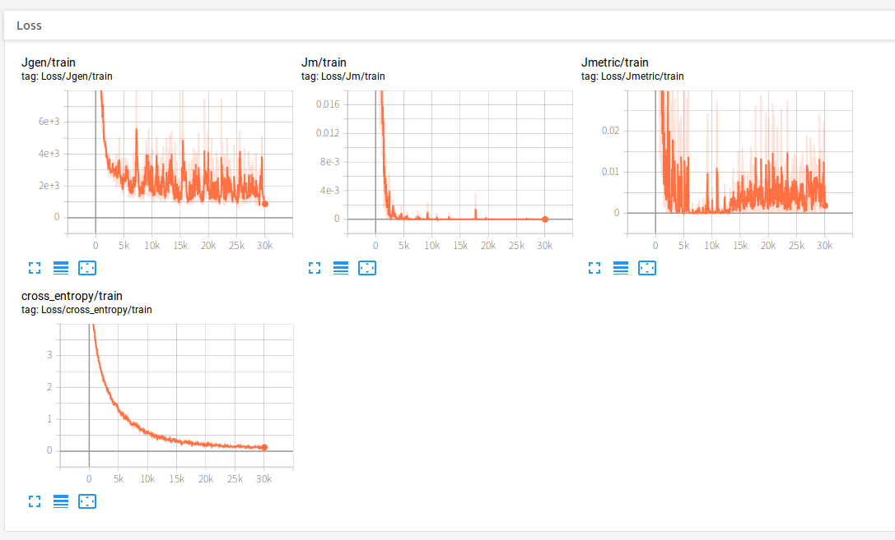
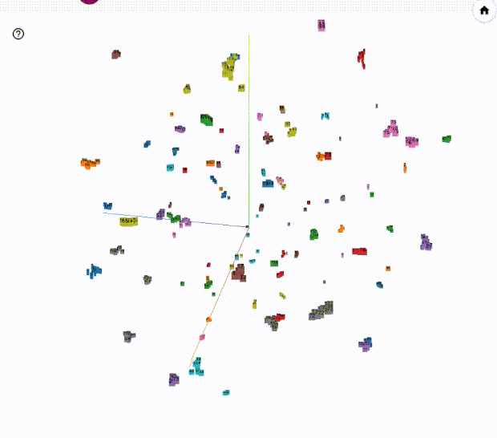

# Hardness-Aware Deep Metric Learning

[](https://paperswithcode.com/sota/metric-learning-on-cars196?p=hardness-aware-deep-metric-learning)

This is an unofficial implementation of ["Hardness-Aware Deep Metric Learning" (CVPR 2019 Oral)](https://arxiv.org/abs/1903.05503) in Pytorch.

## Installation

```
cd pytorch-hdml
pip install pipenv
pipenv install
```

## Download dataset

```
cd data
python cars196_downloader.py
python cars196_converter.py
```

## Train CARS196 dataset
Execute a training script. 
When executed, the tensorboard log is saved.

```
pipenv shell
python train_triplet.py
```

## Result triplet HDML

### CARS196 result on training(99 classes, 30000 iterations)

#### Loss


#### t-SNE


### CARS196 result on testing(97 classes)

#### t-SNE


## Todo

- [ ] Implementation of Npair loss HDML

## Reference

Official tensorflow implementation https://github.com/wzzheng/HDML